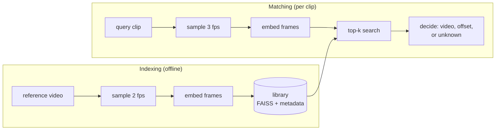

# sceneid: clip-to-video scene identification


Give it a short clip (3 to 60 seconds). It tells you which video in its library the clip
came from and where in that video the clip starts, or answers `unknown` when the clip isn't
from any indexed video.

```
$ sceneid match clip.mp4
MATCH  test1  clip starts at 11.75s
  confidence 0.950, evidence spans 11.75-17.75s
  18 frames, 6145 ms (decode 1853, embed 4235, search 43.4)
```

## Status

This is the v2 rebuild. v1 worked on a few hand-picked videos but was never measured;
v2 is being built around a reproducible benchmark so every number here comes from a
script in this repo.

| Area | State |
|---|---|
| Library: add, remove, persist, integrity checks | done |
| Frame sampling from presentation timestamps (correct on variable-frame-rate video) | done |
| V1 decision rule, ported exactly and checked against the original code | done |
| HTTP API: upload limits, concurrency cap, request ids, JSON logs, Prometheus metrics | done |
| CLI, test suite (no model download needed), CI | done |
| Benchmark: known, unknown and distorted clips; accuracy, timestamp error, ROC, latency | next |
| V2 algorithm: per-video temporal alignment, ratio test, thresholds from the ROC curve | planned |
| Embedder comparison: CLIP, DINOv2, SSCD, perceptual-hash baseline | planned |
| Hosted demo | planned |

**No benchmark results yet.** They will be published here, with the command that
produced them, once the benchmark exists.

## How it works



1. **Sample.** Frames are taken on a fixed grid (every 0.5 s when indexing) using each
   frame's presentation timestamp, so timestamps stay correct on phone recordings.
2. **Embed.** Each frame becomes a unit vector (CLIP ViT-B/32 by default), so inner
   product equals cosine similarity.
3. **Search.** Exact inner-product search in FAISS finds the nearest reference frames for
   every query frame.
4. **Decide.** The algorithm turns those neighbours into an answer: the video, the offset
   where the clip starts (`reference time - query time`), and a confidence. Below the
   confidence gate the answer is `unknown`.

The library records which embedder built it and refuses to be queried with another, and
it cross-checks its files on load, so a stale or half-written library fails loudly
instead of returning wrong answers.

### Known flaws in the v1 decision rule

The v1 rule is kept, unchanged, as the baseline ([`matching/v1.py`](src/sceneid/matching/v1.py)),
so the benchmark can measure these instead of guessing:

- It picks the video by raw vote count over all top-k neighbours, before checking that
  the matches line up in time.
- When too few matches agree on one offset it falls back to using all of them, which
  sets the alignment score to its maximum. On the sample videos this fallback fired for
  both a correct clip and an unrelated one.
- Its vote-ratio gate counts every neighbour, so it gets harder to pass as the library
  grows, right answer or not.

## Quickstart

```bash
python -m venv .venv
source .venv/bin/activate       # Windows: .venv\Scripts\activate
pip install -e ".[clip,api]"

sceneid index path/to/videos/   # every video in the folder
sceneid list
sceneid match clip.mp4          # add --json for the full result
sceneid serve                   # API on http://127.0.0.1:8000, docs at /docs
```

All settings live in [`config.py`](src/sceneid/config.py) and can be overridden with
`SCENEID_*` environment variables, e.g. `SCENEID_QUERY_FPS=2`.

## HTTP API

| Method | Path | |
|---|---|---|
| `POST` | `/v1/match` | multipart upload `clip`; returns the match result |
| `GET` | `/v1/videos` | indexed videos |
| `GET` | `/health` | liveness |
| `GET` | `/health/ready` | readiness: model and library loaded, library size |
| `GET` | `/metrics` | Prometheus metrics |

`unknown` is a normal `200` answer. Errors use one shape and carry the request id:

```json
{"error": {"code": "clip_too_long", "message": "clip is 94.0s; the limit is 60s"},
 "request_id": "3f2a9c1d0b7e4a55"}
```

| Status | Code | When |
|---|---|---|
| 413 | `payload_too_large` | upload over `SCENEID_MAX_UPLOAD_MB` (default 50) |
| 415 | `unsupported_media_type` | not `.mp4 .mov .m4v .mkv .webm .avi` |
| 422 | `unreadable_video`, `clip_too_long` | can't decode it, or over `SCENEID_MAX_CLIP_SECONDS` |
| 503 | `busy` | every matching slot stayed busy for `SCENEID_QUEUE_TIMEOUT_S` |

Matching is CPU-bound, so it runs in worker threads behind a semaphore
(`SCENEID_MAX_CONCURRENT_MATCHES`, default 2) instead of blocking the event loop.

### Observability

- **Logs** are JSON lines with a request id (taken from `X-Request-ID` or generated, and
  echoed back). Every match logs its outcome, confidence, offset and per-stage timings.
- **Metrics** at `/metrics`: request count and latency per route, match outcomes
  (`match`, `unknown`, `bad_input`, `busy`, `error`), time per stage (decode, embed,
  search, decide), confidence distribution, upload sizes, in-flight matches, library size.

## Development

```bash
pip install -e ".[dev]"
pytest              # uses a tiny built-in embedder and synthetic videos: no model download
ruff check . && ruff format --check .
```

`tests/test_v1_parity.py` runs the ported v1 rule and the original v1 code
([`tests/legacy`](tests/legacy)) on 400 random inputs and requires identical answers.

## Layout

```
src/sceneid/
  frames.py        video probing and timestamped frame sampling
  embedders/       CLIP, and a tiny thumbnail embedder (tests and a no-ML baseline)
  library.py       FAISS index + per-vector metadata, persistence, integrity checks
  indexer.py       adding videos to a library
  matcher.py       sample -> embed -> search -> decide, with per-stage timings
  matching/        decision algorithms (v1 baseline)
  api/             FastAPI app and Prometheus metrics
  cli.py           the `sceneid` command
tests/             unit, API, CLI and parity tests
```

## License

MIT
