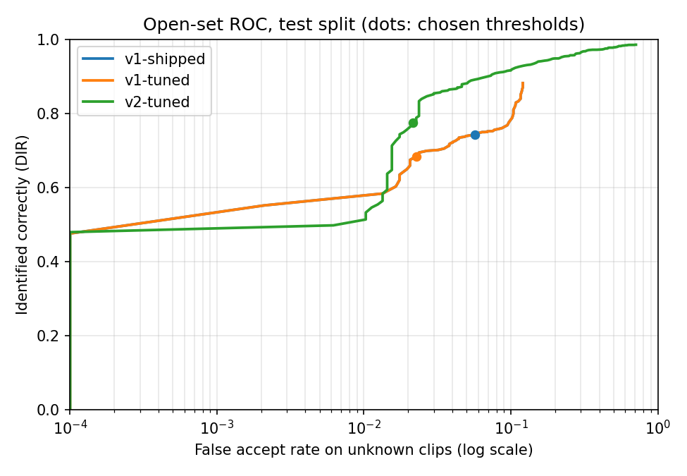
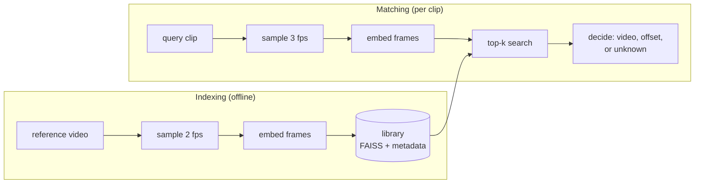

# sceneid: clip-to-video scene identification


Give it a short clip (3 to 60 seconds). It tells you which video in its library the clip
came from and where in that video the clip starts, or answers `unknown` when the clip isn't
from any indexed video.

```
$ sceneid match clip.mp4
MATCH  test1  clip starts at 12.02s
  confidence 0.949, evidence spans 12.02-17.69s
  18 frames, 3332 ms (decode 862, embed 2464, search 3.9)
```

(A 6-second clip cut at 12.0 s from a phone recording, matched on a 4-core laptop CPU.)

## Status

This is the v2 rebuild. v1 worked on a few hand-picked videos but was never measured;
v2 is being built around a reproducible benchmark so every number here comes from a
script in this repo.

| Area | State |
|---|---|
| Library: add, remove, persist, integrity checks | done |
| Frame sampling from presentation timestamps (correct on variable-frame-rate video) | done |
| V1 decision rule, ported exactly and checked against the original code | done |
| HTTP API: upload limits, concurrency cap, request ids, JSON logs, Prometheus metrics | done |
| CLI, test suite (no model download needed), CI | done |
| Benchmark: 18 open films, 6,230 distorted clips, open-set metrics with confidence intervals | done; Tier 1 results below |
| V2 algorithm: per-video temporal alignment, ratio test, sub-second offsets | done; the default |
| V2 thresholds chosen on the benchmark's val split | done (score 0.785, ratio 0.8) |
| Embedder comparison: CLIP, SSCD, DINOv2, perceptual-hash baseline | built; first run pending |
| Hosted demo | planned |

## Results (Tier 1, CLIP ViT-B/32)

13 indexed films (9.4 h, 67,523 frame vectors), 6,230 query clips (623 base clips × 10
distortions), thresholds tuned on the val split for at most 1% false accepts. **Every number
is from the test split** (2,130 clips from indexed films, 970 from held-out films), with 95%
bootstrap intervals over base clips. Full report:
[`benchmarks/results/tier1-clip-vit-b32`](benchmarks/results/tier1-clip-vit-b32/report.md).

| Test split | v1 as shipped | v1 re-tuned | **v2** |
|---|---|---|---|
| Identified correctly (known clips) | 74.2% [71.0, 77.2] | 68.4% [65.3, 71.8] | **77.4%** [74.8, 80.1] |
| False accepts (unknown clips) | 5.7% [3.2, 8.4] | 2.3% [0.9, 4.0] | **2.2%** [0.3, 4.5] |
| Answers that were correct | 96.6% | 98.5% | **98.7%** |
| Accepted as the wrong film | 0 | 0 | 0 |
| Timestamp within 1 s | 89.2% | 89.4% | **94.5%** |
| Timestamp error, median | 0.19 s | 0.18 s | **0.08 s** |

What the run shows:

- **Retrieval isn't the bottleneck.** The right film was the top candidate for 99% of known
  clips under every distortion. Every miss was the accept/reject gate saying `unknown`.
- **v2 vs v1 as shipped** (paired bootstrap): false accepts fall by 3.5 points (CI 0.5 to
  6.8); identification rises 3.2 points, which is *not* significant on its own (CI −0.1 to
  +6.7). **At the same false-accept rate as a re-tuned v1**, v2 identifies 9.0 points more
  clips (CI +5.7 to +12.3).
- **Weak spots:** cropped (45% identified), letterboxed (61%), overlaid (62%) and
  screen-recorded (64%) clips. The right film is still found, but similarity drops below
  the gate. Speed-changed clips are identified (95%) but only 78% of their timestamps land
  within 1 s, since v2 assumes normal speed.
- **All 21 of v2's false accepts are 3-second clips** from look-alike films (Carnival of
  Souls, Scarlet Street, A Star Is Born). No 5 or 10-second unknown clip was accepted.
- **Caveats.** The false-accept target was met on val (0.8%) but came out at 2.2% on test:
  with about 100 unknown base clips per split, false-accept estimates are coarse. The
  library is small (13 films); Tier 2 (~100 h) tests whether this holds at scale.



## How it works



1. **Sample.** Frames are taken on a fixed grid (every 0.5 s when indexing) using each
   frame's presentation timestamp, so timestamps stay correct on phone recordings.
2. **Embed.** Each frame becomes a unit vector (CLIP ViT-B/32 by default), so inner
   product equals cosine similarity.
3. **Search.** Exact inner-product search in FAISS finds the nearest reference frames for
   every query frame.
4. **Decide.** The algorithm turns those neighbours into an answer: the video, the offset
   where the clip starts (`reference time - query time`), and a confidence. Below the
   confidence gate the answer is `unknown`.

The library records which embedder built it and refuses to be queried with another, and
it cross-checks its files on load, so a stale or half-written library fails loudly
instead of returning wrong answers.

### Decision rules: v1 (baseline) and v2

The v1 rule is kept, unchanged, as the baseline ([`matching/v1.py`](src/sceneid/matching/v1.py)),
so the benchmark can measure its flaws instead of guessing:

- It picks the video by raw vote count over all top-k neighbours, before checking that
  the matches line up in time.
- When too few matches agree on one offset it falls back to using all of them, which
  sets the alignment score to its maximum. On the sample videos this fallback fired for
  both a correct clip and an unrelated one.
- Its vote-ratio gate counts every neighbour, so it gets harder to pass as the library
  grows, right answer or not.
- Its timestamp is the centre of a half-second histogram bin, so it is up to 0.25 s off
  even when everything else is right.

v2 ([`matching/v2.py`](src/sceneid/matching/v2.py)) fixes each of these. For every video it
finds the offset at which the most query frames line up, counting each frame once; frames
that don't line up count for nothing. A video's score is the clip's average similarity at
that offset. The best video must beat the runner-up by a margin (a ratio test, independent
of library size), and the offset is the weighted median of the aligned frames, not a bin.

v2 is the default. Its thresholds (score ≥ 0.785, runner-up ratio ≤ 0.8) were chosen on the
benchmark's val split and scored on its test split; they are tuned for CLIP ViT-B/32. The
v1 rule is still available with `--algorithm v1` or `SCENEID_ALGORITHM=v1`.

## Benchmark

**Films.** 18 films that are free to cut up and show ([manifest](benchmarks/datasets/tier1.json),
with licences and checksums). The system indexes 13 of them (≈9.4 h). The other 5 (≈5.1 h) are
never indexed: their clips must come back `unknown`, and each one is a look-alike of an indexed
film (another Caminandes episode, another 1945 film noir, another early Technicolor film, ...).

| Source | Films | Licence |
|---|---|---|
| Blender Foundation open movies | Big Buck Bunny, Sintel, Tears of Steel, Elephants Dream, Cosmos Laundromat, Caminandes 1-3, Sprite Fright | CC BY |
| Internet Archive feature films | Night of the Living Dead, His Girl Friday, The Little Shop of Horrors, Detour, The General, Royal Wedding, Carnival of Souls, Scarlet Street, A Star Is Born | US public domain |

**Clips.** A seeded script places about one 3, 5 or 10 s clip per minute of film (skipping opening
titles and end credits) and renders each one ten ways: `original`, `compression`, `downscale` (240p),
`crop`, `letterbox`, `mirror`, `color`, `overlay` (logo and caption bar), `speed` (1.25x) and
`screen_recording` (bezel, tilt, blur, noise). That's about 620 base clips and 6,200 queries.

**Scoring.** Open-set identification metrics: correctly identified (DIR), false accepts on unknown
clips (FAR), rejections, wrong-film accepts, top-1 before the gate, and timestamp error. Thresholds
are chosen on the val split (highest DIR with FAR ≤ 1%) and every reported number is from the
separate test split. 95% intervals come from resampling base clips, since the ten versions of one
clip aren't independent. Results are broken down by distortion, clip length, look-alike group and
film, with per-stage latency and index size.

**Running it.** Embedding needs a GPU, so the full run is a
[Colab notebook](notebooks/benchmark_colab.ipynb)
([open in Colab](https://colab.research.google.com/github/saarvesh0606/clip-to-video-scene-id/blob/main/notebooks/benchmark_colab.ipynb)).
Every step is resumable. The same steps from a shell:

```bash
pip install -e ".[clip,bench]"   # plus ffmpeg on PATH
sceneid bench download           # ~7 GB, checksums verified
sceneid bench queries            # the answer key
sceneid bench index              # the library films
sceneid bench embed              # render + embed every clip (GPU recommended)
sceneid bench evaluate           # report -> benchmarks/results/tier1-clip-vit-b32/
```

**Comparing embedders.** A second notebook,
[`compare_embedders_colab.ipynb`](notebooks/compare_embedders_colab.ipynb)
([open in Colab](https://colab.research.google.com/github/saarvesh0606/clip-to-video-scene-id/blob/main/notebooks/compare_embedders_colab.ipynb)),
scores CLIP, [SSCD](https://github.com/facebookresearch/sscd-copy-detection) (built for copy
detection), [DINOv2](https://huggingface.co/facebook/dinov2-base) and a 64-bit perceptual hash
on the same answer key. Each film and clip is decoded once and fed to every embedder, and
rendered clips are saved (`--clips-dir`), so rendering, the slow part, happens only once:

```bash
sceneid bench index    --embedders clip-vit-b32 sscd-disc-mixup dinov2-base phash64
sceneid bench embed    --embedders clip-vit-b32 sscd-disc-mixup dinov2-base phash64
sceneid bench evaluate --embedders clip-vit-b32 sscd-disc-mixup dinov2-base phash64
sceneid bench compare benchmarks/results/tier1-* --out benchmarks/results/comparison.md
```

## Quickstart

```bash
python -m venv .venv
source .venv/bin/activate       # Windows: .venv\Scripts\activate
pip install -e ".[clip,api]"

sceneid index path/to/videos/   # every video in the folder
sceneid list
sceneid match clip.mp4          # add --json for the full result
sceneid serve                   # API on http://127.0.0.1:8000, docs at /docs
```

All settings live in [`config.py`](src/sceneid/config.py) and can be overridden with
`SCENEID_*` environment variables, e.g. `SCENEID_QUERY_FPS=2`.

## HTTP API

| Method | Path | |
|---|---|---|
| `POST` | `/v1/match` | multipart upload `clip`; returns the match result |
| `GET` | `/v1/videos` | indexed videos |
| `GET` | `/health` | liveness |
| `GET` | `/health/ready` | readiness: model and library loaded, library size |
| `GET` | `/metrics` | Prometheus metrics |

`unknown` is a normal `200` answer. Errors use one shape and carry the request id:

```json
{"error": {"code": "clip_too_long", "message": "clip is 94.0s; the limit is 60s"},
 "request_id": "3f2a9c1d0b7e4a55"}
```

| Status | Code | When |
|---|---|---|
| 413 | `payload_too_large` | upload over `SCENEID_MAX_UPLOAD_MB` (default 50) |
| 415 | `unsupported_media_type` | not `.mp4 .mov .m4v .mkv .webm .avi` |
| 422 | `unreadable_video`, `clip_too_long` | can't decode it, or over `SCENEID_MAX_CLIP_SECONDS` |
| 503 | `busy` | every matching slot stayed busy for `SCENEID_QUEUE_TIMEOUT_S` |

Matching is CPU-bound, so it runs in worker threads behind a semaphore
(`SCENEID_MAX_CONCURRENT_MATCHES`, default 2) instead of blocking the event loop.

### Observability

- **Logs** are JSON lines with a request id (taken from `X-Request-ID` or generated, and
  echoed back). Every match logs its outcome, confidence, offset and per-stage timings.
- **Metrics** at `/metrics`: request count and latency per route, match outcomes
  (`match`, `unknown`, `bad_input`, `busy`, `error`), time per stage (decode, embed,
  search, decide), confidence distribution, upload sizes, in-flight matches, library size.

## Development

```bash
pip install -e ".[dev]"
pytest              # uses a tiny built-in embedder and synthetic videos: no model download
ruff check . && ruff format --check .
```

`tests/test_v1_parity.py` runs the ported v1 rule and the original v1 code
([`tests/legacy`](tests/legacy)) on 400 random inputs and requires identical answers.

## Layout

```
src/sceneid/
  frames.py        video probing and timestamped frame sampling
  embedders/       CLIP, SSCD, DINOv2, a perceptual hash, and a tiny thumbnail (for tests)
  library.py       FAISS index + per-vector metadata, persistence, integrity checks
  indexer.py       adding videos to a library
  matcher.py       sample -> embed -> search -> decide, with per-stage timings
  matching/        decision rules: v1 (baseline, unchanged) and v2
  api/             FastAPI app and Prometheus metrics
  bench/           the benchmark: downloads, answer key, distortions, embedding, scoring, report
  cli.py           the `sceneid` command
benchmarks/        dataset manifests and published results
notebooks/         Colab notebooks: the benchmark, and the embedder comparison
tests/             unit, API, CLI and parity tests
```

## License

MIT
